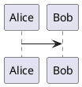

| Right | Center | Left  |
| ----: | :----: | :---- |
| 10    | 10     | 10    |
| 1000  | 1000   | 1000  |

| Right | Center | Left  |
| ----: | :----: | :---- |
| 10    | 10     | 10    |
| ^     | 1000   | 1000  |
| 1000  | 1000   | 1000  |

| Right | Center | Left  |
| ----: | :----: | :---- |
| 10    | 10     | 10    |
| 1000  |||
| 1000  | 1000   | 1000  |

~~~~~~~~~~~~~{.py}
# A class
class Dummy:
    pass
~~~~~~~~~~~~~

~~~~~~~~~~~~~~~{.c}
int func(int a,int b) { return a*b; }
~~~~~~~~~~~~~~~

